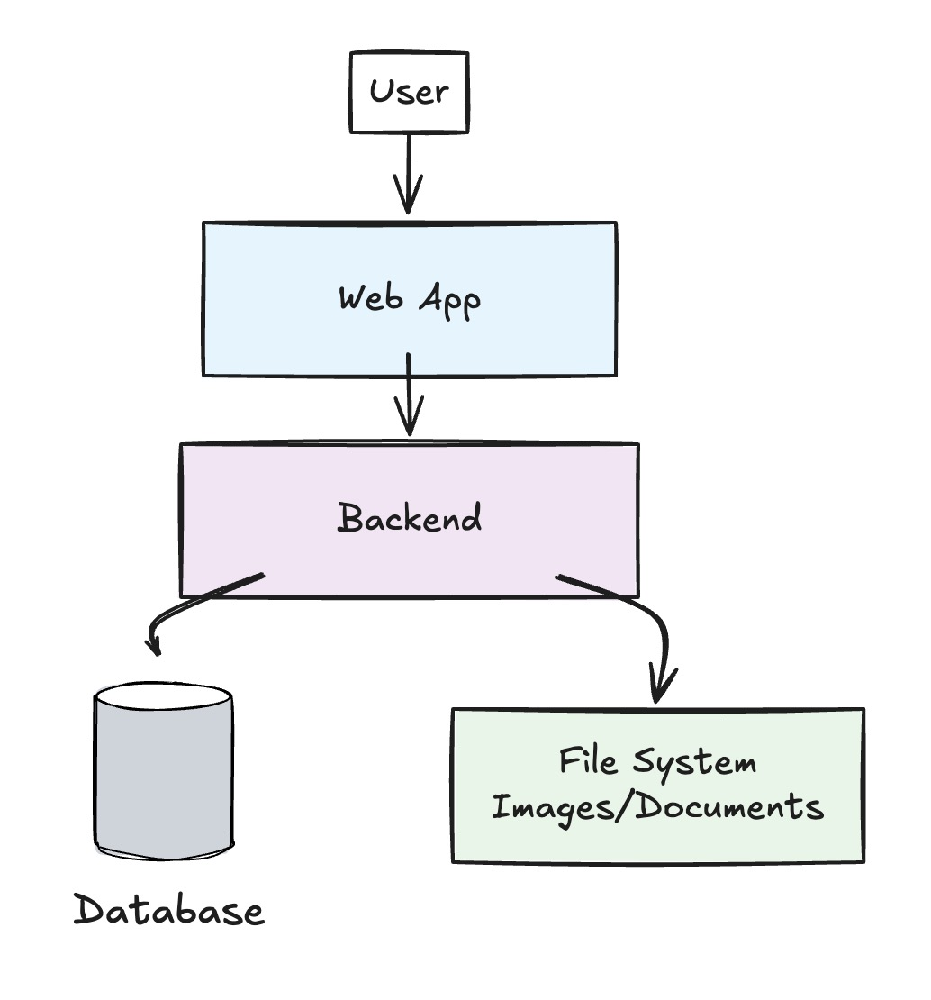
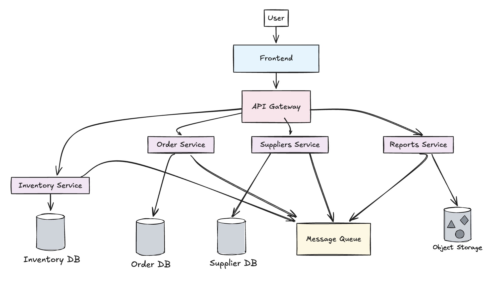

# Inventory Management System Challenge

## Detail

### Business Domain or Category

Supply Chain & Warehouse Management - Enterprise inventory tracking and stock management system

### Project Description

An inventory management system for tracking and managing stock levels with automated alerts, supplier management, and reporting capabilities.

### Why

Businesses need better inventory control to prevent stockouts, reduce carrying costs, and automate manual tracking processes.

## Overall architecture

[Insert your overall architecture here]

## Possible Architecture

This is just a starting point for the architecture. You can come up with your own design.

### 1. Simple Local Architecture

### 2. 3-Tiers Architecture

### 3. Microservices Architecture

