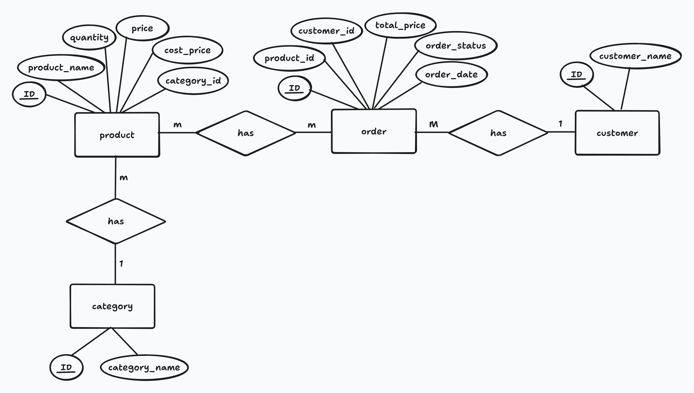
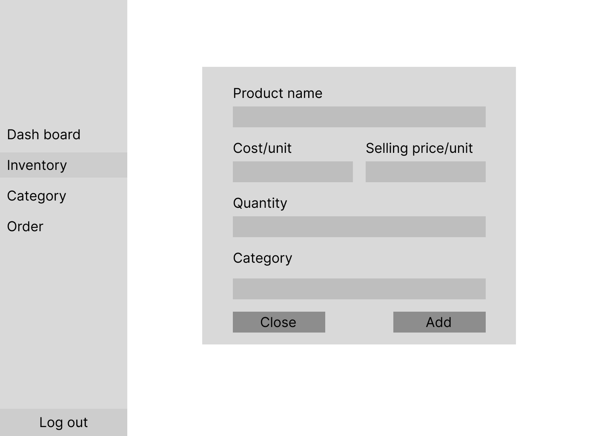
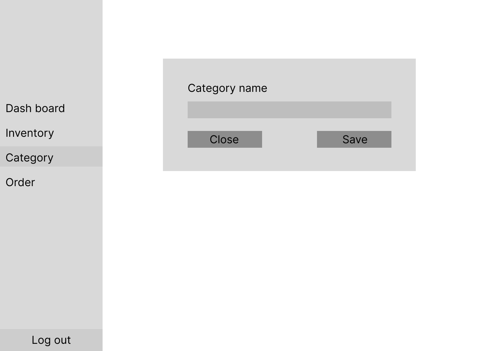
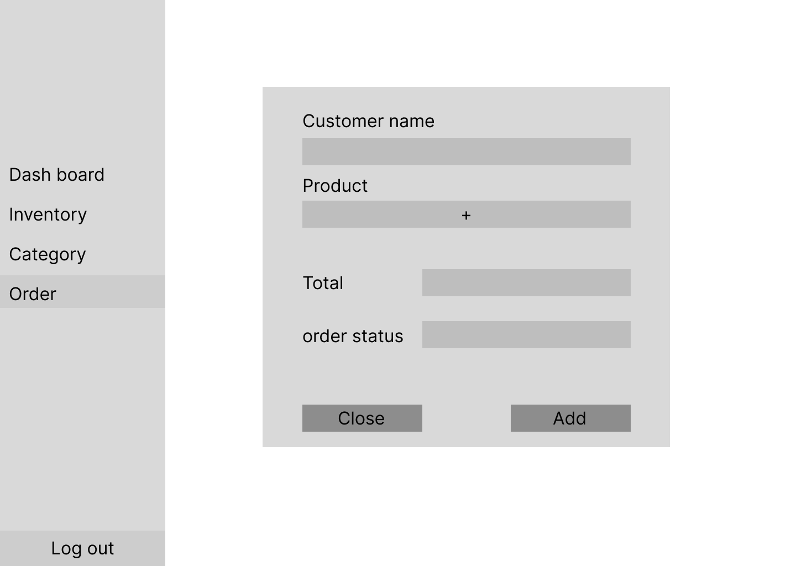
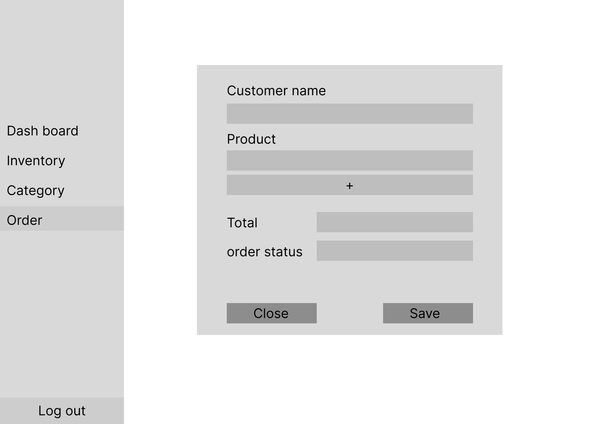
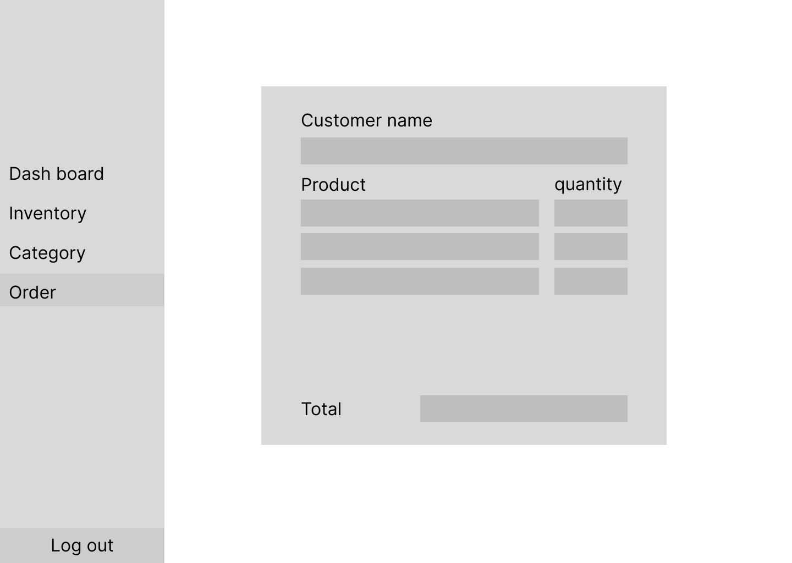

# Initial warehouse/inventory management system

## Context

Currently, we are managing stock by using paper. It has been effective for now. However, our business keep growing, tracking by paper is not enough anymore. There are some problems with it as well.

For example

- We need to find the product name on paper for checking the current amount of product.
- Need to calculate income, outcome, and profit by hand. And sometimes we are losing track.

That's being said, I would like to introduce system to help manage our warehouse to reduce & minimize error factors.

## Decision

- Create web-based application for our staff. 
- 3-tier architecture will be used in the initial version.
- Frontend: React
- Backend: Node.js (Express)
- Database: MySQL

## Consequences

- Staff members can manage the warehouse via the website.
- Accessible across multiple kinds of devices. PC, Mobiles, and etc.

## Design

Database ER daigram

## Wireframe

#### Dashboard page

#### Inventory page

- seller can add product

- seller can edit product

#### Category page

- Seller can add category for product.

- seller can edit catefory name

#### Order page

- Seller can add orders.

- If the order status is draft, the items in the order can be edited.

- If the order status is complete, seller cannot edit it, only view order detail

